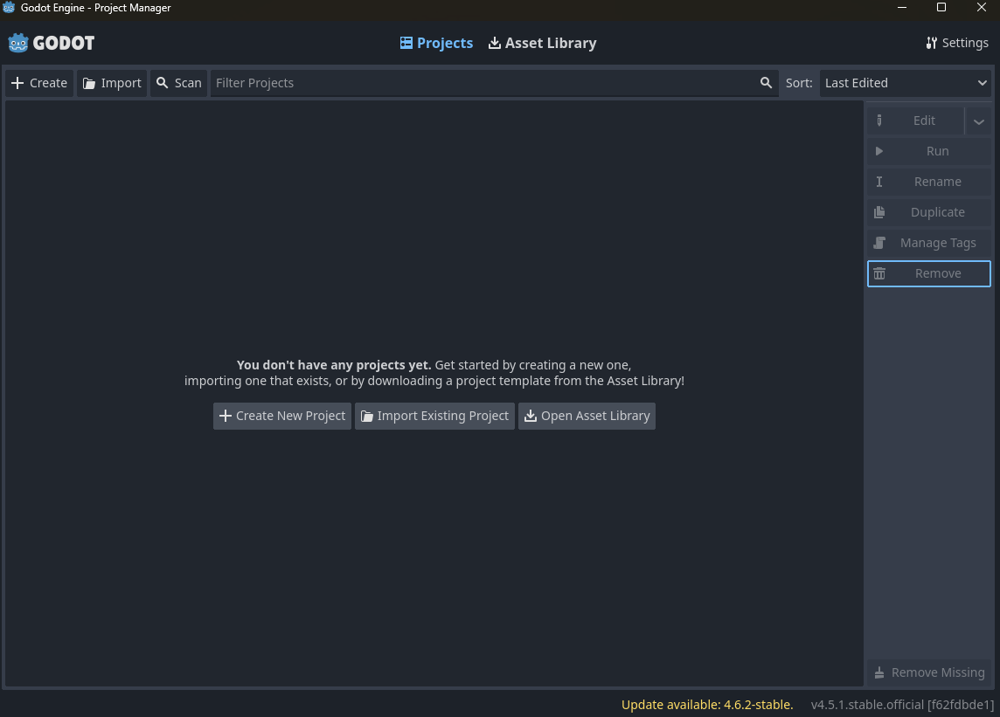
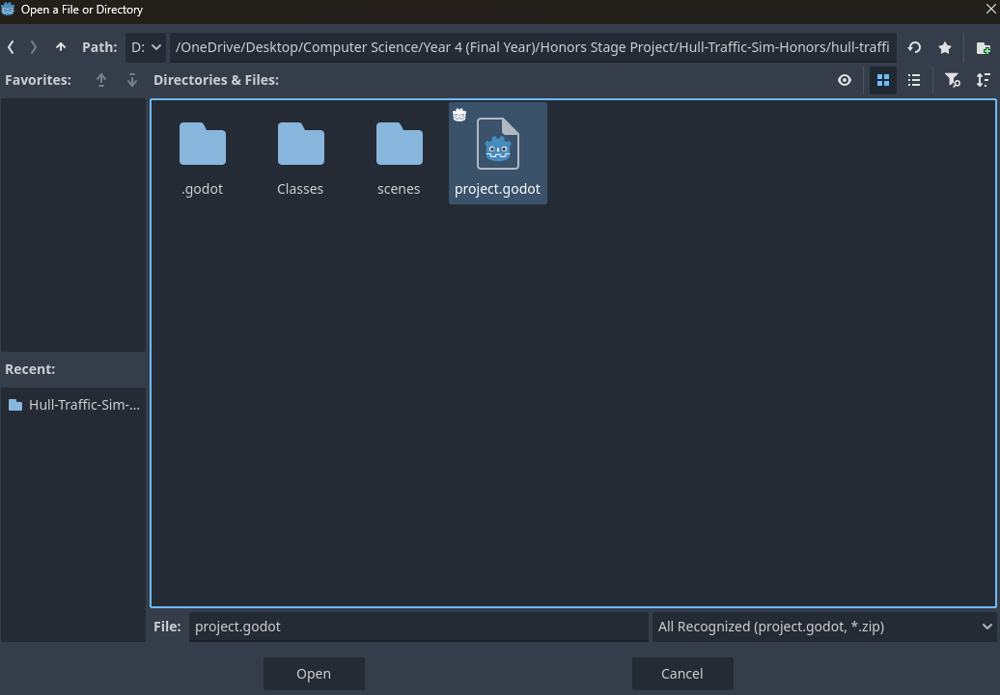

# Hull-Traffic-Sim-Honors
## What the Different Files Are
- The file ``Godot_v4.5.1-stable_win64.exe`` contains a copy of the GODOT engine for 64-bit windows and can be used to view the source code and rebuild the simulation executable if needed.
- The file ``hull-traffic-sim-source`` contains all the source code for the Hull Traffic Simulator.
- The file ``HullTrafficSimExecutable.exe`` is the fully built product and can be used completely standalone, to run simply double click the exe.
- The file ``README.md`` is this markdown file.

## Additonal Notes
Everything was built and run on a Windows 11 PC, and not tested on other operating systems.

## How to View the Source Code
To view the source code, first open and run the ``Godot_v4.5.1-stable_win64.exe`` file, this should bring up this window:

Then click "Import Existing Project" and select the ``project.godot`` file in the source code directory, shown below:

Once selected, it should be possible to view the source code.

## How to Build
Once the GODOT engine window is open with the project loaded, it can be built and exported into an .exe via going to Project -> Export -> Export All